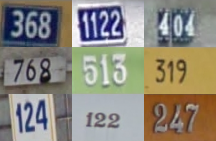

# Street view character recognition
### Requirements
- Python3
- Pytorch

### Project Description
This project uses neural networks (CNN, Resnet18) to realize street view character recognition, where the data comes from The Street View House Numbers Dataset（SVHN）

- **Recognition of variable-length characters is converted to fixed-length characters**: most of the characters are 2-4, and the recognition of all images can be converted into a recognition problem of 6 characters. Images with insufficient character length can be filled with "10".

- Data set:
     - Training data set: 3w photos
     - Validation data set: 1w photos
     - Test data set: 4w photos

     

    